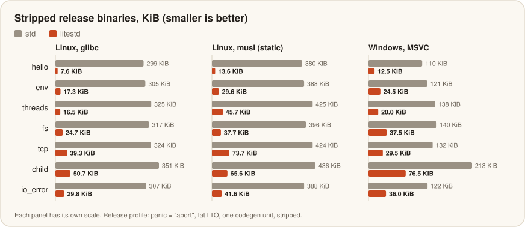

<div align="center">

# 

[![Crates.io][crates-badge]][crates-url]
[![Documentation][doc-badge]][doc-url]
[![License][license-badge]][license-url]
[![MSRV][msrv-badge]][msrv-url]

[crates-badge]: https://img.shields.io/crates/v/litestd.svg?style=for-the-badge
[crates-url]: https://crates.io/crates/litestd
[doc-badge]: https://img.shields.io/docsrs/litestd?style=for-the-badge
[doc-url]: https://docs.rs/litestd
[license-badge]: https://img.shields.io/badge/license-MIT%2FApache--2.0-blue.svg?style=for-the-badge
[license-url]: #license
[msrv-badge]: https://img.shields.io/badge/rustc-1.85%2B-orange.svg?style=for-the-badge
[msrv-url]: #minimum-supported-rust-version

</div>

> [!WARNING]
> litestd is experimental until we remove this note.
>
> Versions follow `1.EDITION.PATCH`. `1` is Rust's major version, `EDITION`
> is the Rust edition litestd targets (`24` for Rust 2024), and `PATCH`
> counts the releases within that edition. We ship `1.24.x` releases until
> the next Rust edition reaches stable, then move litestd to it. litestd
> itself always uses the latest edition; your crate can use any edition.

std's OS-dependent API for `no_std` crates: threads, locks, time, files,
sockets, processes, the environment and the standard streams, built on the
operating system's own primitives.

## Why litestd

litestd began with a question: why should I leave `no_std` when I need only
a small part of std? I write small command-line tools and C shared libraries
in Rust, and for them std was overkill.

litestd lets library authors support `no_std` while their code keeps calling
std's API, and lets small tools stay `no_std` when they use only part of std.
It reimplements the parts of std that need an operating system, with std's
paths, signatures and trait implementations, and re-exports `core` and
`alloc` where std has them. One switch at the top of a crate replaces std:

```rust
#![cfg_attr(not(feature = "std"), no_std)]

#[cfg(not(feature = "std"))]
#[macro_use]
extern crate litestd as std;
```

The rest of the crate keeps its `std::` paths and builds either way. The
`no_std` prelude lacks `Box`, `String`, `ToString`, `Vec` and `ToOwned`:
import them (`use std::vec::Vec;`) or glob-import
`std::prelude::rust_2024::*`. Both forms compile against std too.

## Installation

```toml
[dependencies]
litestd = "1"
```

`"1"` accepts every `1.x.y` release. A binary that wants to stay on the Rust
2024 line can pin it with a tilde requirement, which accepts `1.24.x` only:

```toml
[dependencies]
litestd = "~1.24"
```

Libraries should stay on `"1"`. Each copy of litestd defines the panic
handler, so a build holds one copy at most, and Cargo resolves every `1.x`
requirement to one version. A library pinned to `~1.24` cannot share a build
with a crate that needs `1.27`.

### Binaries

A `no_std` binary aborts on panic, exports C's `main`, and registers
litestd's global allocator unless it brings its own:

```toml
[dependencies]
litestd = { version = "1", features = ["global-allocator"] }

[profile.dev]
panic = "abort"

[profile.release]
panic = "abort"
```

```rust
#![no_std]
#![no_main]

#[macro_use]
extern crate litestd as std;

use std::ffi::{c_char, c_int};

#[unsafe(no_mangle)]
extern "C" fn main(_argc: c_int, _argv: *const *const c_char) -> c_int {
    println!("Hello, world!");
    0
}
```

On WASI, export the function under wasi-libc's name for C's `main`, as
[WebAssembly](#webassembly) shows.

By default a panic prints nothing and aborts. `panic-location` prints
`panicked at src/main.rs:10:5` first, and `panic-message` adds the message,
as std prints it. The message costs from a few KiB to tens of KiB, because
every panic then keeps the code that formats it.

### Tests

Test binaries link std, so they need `test-with-std`, which compiles
litestd's panic handler out:

```toml
[dev-dependencies]
litestd = { version = "1", features = ["test-with-std"] }
```

Never enable `test-with-std` outside tests, and never enable it or
`custom-panic-handler` in a library: either one would silence the check that
keeps std and litestd apart for every program that uses the library.

## Use only the features you need

Each module is a Cargo feature, and all of them are on by default. A library
should turn the defaults off and list what it uses, so that programs built on
it compile nothing else. Parking and unparking threads needs `thread` alone,
which brings in `alloc` and `io`:

```toml
[features]
default = ["std"]
std = []

[dependencies]
litestd = { version = "1", default-features = false, features = ["thread"] }
```

```rust
#![cfg_attr(not(feature = "std"), no_std)]

#[cfg(not(feature = "std"))]
extern crate litestd as std;

use std::{
    sync::{
        Arc,
        atomic::{AtomicBool, Ordering},
    },
    thread,
};

/// Runs `job` on a new thread and parks the caller until it finishes.
pub fn run_and_wait(job: fn()) {
    let done = Arc::new(AtomicBool::new(false));
    let waiter = thread::current();
    let flag = Arc::clone(&done);
    let worker = thread::spawn(move || {
        job();
        flag.store(true, Ordering::Release);
        waiter.unpark();
    });
    // `park` can return without an `unpark`, so check the flag each time.
    while !done.load(Ordering::Acquire) {
        thread::park();
    }
    worker.join().unwrap();
}
```

With `std` on, the crate uses std and litestd never reaches the binary. With
`default-features = false`, the same code builds `no_std` on litestd.

| Feature   | Provides                                                                                        | Needs                            |
|-----------|-------------------------------------------------------------------------------------------------|----------------------------------|
| `alloc`   | `alloc` at std's paths: `Box`, `Vec`, `String`, `collections`, `sync::Arc`                      |                                  |
| `command` | `process::{Command, Child, Output, ExitStatus, Stdio}`, `os::*::process`                        | `alloc`, `io`, `path`, `process` |
| `env`     | `env::{args, var, vars, current_dir, current_exe, temp_dir, home_dir}`                          | `alloc`, `io`, `path`            |
| `fs`      | `fs` and the `os::*::fs` extension traits                                                       | `alloc`, `io`, `path`, `time`    |
| `io`      | `Read`, `Write`, `Seek`, `BufRead`, the buffered types, `Cursor`, `Error`, `pipe`, `os::fd`     | `alloc`                          |
| `net`     | `TcpStream`, `TcpListener`, `UdpSocket`, `ToSocketAddrs`, `os::unix::net`                       | `alloc`, `io`                    |
| `path`    | `Path`, `PathBuf`, `OsStr`, `OsString`, `os::*::ffi`                                            | `alloc`                          |
| `process` | `process::{exit, abort, id}`                                                                    |                                  |
| `stdio`   | `print!`, `println!`, `eprint!`, `eprintln!`, `dbg!`; with `io`, `io::{stdin, stdout, stderr}`  |                                  |
| `sync`    | `Mutex`, `RwLock`, `Condvar`, `Once`, `OnceLock`, `LazyLock`, `Barrier`                         |                                  |
| `thread`  | `thread::{spawn, scope, park, sleep, current, Builder}`, `thread_local!`                        | `alloc`, `io`                    |
| `time`    | `Instant`, `SystemTime`, `UNIX_EPOCH`                                                           |                                  |

`sync::atomic`, `time::Duration` and the `net` address types need no feature.
Without `alloc`, litestd does not link the `alloc` crate, so a binary needs
no global allocator. These features are off by default:

| Feature                | Effect                                                                                  |
|------------------------|-----------------------------------------------------------------------------------------|
| `global-allocator`     | Registers `alloc::System` as the global allocator. Binaries only.                       |
| `panic-location`       | The panic handler prints the panic's location to stderr. Binaries only.                |
| `panic-message`        | The panic handler prints the location and the message, as std does. Binaries only.     |
| `custom-panic-handler` | Compiles litestd's panic handler out, for a binary that defines its own.               |
| `test-with-std`        | Compiles the panic handler out for test binaries, which link std. Tests only.          |
| `nightly`              | Needs a nightly compiler. `thread_local!` uses native thread-locals, as std does. Required for WebAssembly with threads. |

## Why no `HashMap` or channels?

litestd stays small so that it stays maintainable. It will never cover all of
std, and an item outside its scope stays out.

- **`HashMap` and `HashSet`**: std builds them on
  [hashbrown](https://crates.io/crates/hashbrown), which works in `no_std`.
  Depend on hashbrown directly, as std does. `BTreeMap` and the rest of
  `alloc`'s collections are in `std::collections`.
- **Channels** (`std::sync::mpsc`): I plan to add `no_std` support to my
  channel library, [kanal](https://github.com/fereidani/kanal).
- **Also out**: `panic::catch_unwind` and panic hooks, since litestd never
  unwinds; `std::backtrace`; the CPU feature detection macros such as
  `is_x86_feature_detected!`; and float math such as `f64::sqrt`, which
  needs a crate like [libm](https://crates.io/crates/libm) in `no_std`.

If you miss an item that belongs to std's OS layer, open an issue.

## How litestd differs from std

Every item litestd provides has std's path, signature, trait implementations
and auto traits. The differences below come from running without std's
runtime, without unwinding, and with smaller code.

### std and litestd do not mix

std and litestd both define the panic handler, so a build that links both
fails:

```text
error[E0152]: duplicate lang item in crate `litestd` (which `app` depends on): `panic_impl`
  |
  = note: the lang item is first defined in crate `std` (which `app` depends on)
```

Every crate in a `no_std` program must support `no_std`, or have its `std`
feature off. A std program can depend on a library that uses litestd only if
that library switches to std, as the example above does with its `std`
feature.

### Panics

- Every panic aborts the process, in any thread. `JoinHandle::join` always
  returns `Ok`, `thread::panicking` returns `false`, and no lock ever
  poisons. The poison types stay, so code written for std compiles unchanged.
- A panic prints nothing unless you enable `panic-location` or
  `panic-message`.
- A stack overflow crashes with a plain `SIGSEGV` or access violation,
  without std's "has overflowed its stack" message. litestd does not read
  `RUST_MIN_STACK`.
- At a few limits where std panics, litestd waits or aborts: the reader
  after 2^30 - 2 concurrent `RwLock` readers waits, and running out of
  `ThreadId`s aborts.

### Output

- Standard output is unbuffered, like standard error. std line-buffers
  stdout; litestd writes each `print!` call with one system call, up to
  1 KiB, so no output is lost when the process aborts. Many small prints
  cost one call each; wrap `io::stdout().lock()` in a `BufWriter` for those.
- `io::copy` always copies through a buffer. On Linux, std's `io::copy`
  uses `copy_file_range`, `splice` and `sendfile` between descriptors;
  litestd uses `copy_file_range` and `sendfile` in `fs::copy` only.
- `BufWriter` and `LineWriter` never use the inner writer's vectored writes,
  as std treats every writer defined outside std.
- `Write::write_fmt` returns an error when a formatting trait fails, where
  std panics.
- `cargo test` does not capture what litestd prints.

### Threads and thread-locals

- On stable Rust, `thread_local!` finds each value through one OS key and a
  per-thread table, which makes an access about 3x slower than std's. The
  `nightly` feature gives each static a native thread-local, as std does, at
  std's speed.
- On Unix and WebAssembly, thread-local destructors do not run for the main
  thread, nor on WebAssembly for the threads the host starts. On Windows,
  stable builds keep values per fiber.

### Startup and the environment

- litestd has no runtime of its own. On Unix, with the `io` or `stdio`
  feature, a small initializer does the startup work of std's runtime before
  `main`: it opens `/dev/null` on closed standard descriptors and ignores
  `SIGPIPE`, so a write to a closed pipe fails with `BrokenPipe`, as in std.
- With musl, on Android and on the BSDs, `env::args` reads the arguments
  from the OS on first use. With musl and on Android they come from
  `/proc/self/cmdline`, so they are empty when `/proc` is not mounted.
- `env::set_var` and `env::remove_var` are `unsafe` in every edition, not
  only in Rust 2024, so Rust 2021 code calls them in an `unsafe` block too.

### Smaller differences

- `Command::output` and `Child::wait_with_output` return an error where std
  panics because reading the child's output failed.
- `process::Termination::report` prints an `Err` only with the `stdio`
  feature.

### When not to use litestd

- Your program must survive a panic: a server that isolates requests with
  `catch_unwind`, or a plugin host.
- A dependency needs std and has no `no_std` mode. Most async runtimes and
  many popular crates fall in this group.
- You need `HashMap`, channels, backtraces or float math, and you do not want
  to add hashbrown, kanal or libm.
- You target a platform litestd does not support, such as iOS, or an older
  release than the ones listed below.
- Your program prints many small lines and you cannot wrap stdout in a
  `BufWriter`.
- Size and speed do not matter to you. std has years of use behind it;
  litestd is young.

## Binary size

`scripts/size.sh` builds seven small programs twice from the same source,
once on std and once on litestd, with the same release profile:
`panic = "abort"`, fat LTO, one codegen unit, and stripped symbols. The std
builds link the prebuilt std that rustup ships.

<p align="center"></p>

| Program | What it does | glibc, std / litestd | musl, std / litestd | MSVC, std / litestd |
|---|---|---:|---:|---:|
| `hello` | prints a line | 298.7 / **7.6** KiB | 380.5 / **13.6** KiB | 110.5 / **12.5** KiB |
| `env` | reads the arguments and the environment | 304.6 / **17.3** KiB | 388.5 / **29.6** KiB | 121.0 / **24.5** KiB |
| `threads` | four threads, a `Mutex` and a `Condvar` | 324.7 / **16.5** KiB | 424.6 / **45.7** KiB | 137.5 / **20.0** KiB |
| `fs` | writes, reads, lists and removes a file | 317.0 / **24.7** KiB | 396.5 / **37.7** KiB | 140.0 / **37.5** KiB |
| `tcp` | echoes a message over loopback TCP | 324.0 / **39.3** KiB | 424.5 / **73.7** KiB | 132.0 / **29.5** KiB |
| `child` | runs a child process and reads its output | 350.7 / **50.7** KiB | 436.5 / **65.6** KiB | 213.0 / **76.5** KiB |
| `io_error` | prints `io::Error`s with `Display` and `Debug` | 307.1 / **29.8** KiB | 388.5 / **41.6** KiB | 121.5 / **36.0** KiB |

A std program links std's runtime and panic machinery even under
`panic = "abort"`. Its default panic hook can print a backtrace, so every
std binary carries a symbolizer: in the glibc `hello`, gimli, addr2line,
rustc-demangle and miniz_oxide take about 76 KiB, and core's formatting and
panic code much of the rest. litestd's panic handler aborts, or prints the
location without the formatting machinery, and litestd keeps formatting code
off the paths that do not report errors. Each program pays only for the
modules it uses. With Windows' GNU toolchain, litestd's programs are 2.8x to
4.2x smaller than std's.

Run `scripts/size.sh` to measure on your machine, and
`scripts/size.sh symbols hello` to list what a litestd program contains.

## Supported platforms

| Platform                             | Threads block on               |
|--------------------------------------|--------------------------------|
| Linux, with glibc or musl            | `futex(2)`                     |
| Android                              | `futex(2)`                     |
| Windows 10 version 1607 and later    | `WaitOnAddress`                |
| macOS 14.4 and later                 | `os_sync_wait_on_address`      |
| FreeBSD 12.2 and later               | `_umtx_op`                     |
| NetBSD 10 and later                  | `__futex`                      |
| OpenBSD 6.2 and later                | `futex(2)`                     |
| DragonFly                            | `umtx_sleep` and `umtx_wakeup` |
| WebAssembly without threads          | nothing: one thread runs       |
| WebAssembly with threads (`nightly`) | `memory.atomic.wait32`         |

Windows builds with the GNU and MSVC toolchains. Any other target fails to
compile with a clear error, and a macOS program built on litestd does not
start on releases before 14.4. Linux and Windows come first; macOS and the
BSDs follow.

### WebAssembly

litestd builds for `wasm32-wasip1`, `wasm32-wasip2` and
`wasm32-unknown-unknown` on stable Rust. Without the `atomics` target
feature a module runs one thread: `thread::spawn` fails, as in std, and a
wait that no other thread could end, such as locking a `Mutex` twice,
aborts where std panics.

With `atomics`, threads share the memory and block on
`memory.atomic.wait32`. Rust's intrinsic for it is unstable, so litestd
needs its `nightly` feature there and fails to compile without it.
`wasm32-wasip1-threads` spawns threads through wasi-libc. On
`wasm32-unknown-unknown` the host starts them, as wasm-bindgen-rayon does
with Web Workers, and `thread::spawn` fails as in std. Build that target
with the flags wasm-bindgen documents for threads: `+atomics`,
`+bulk-memory`, `--shared-memory` and the `__tls_*` exports. A browser's
main thread may not block, in litestd as in std.

A WASI program exports wasi-libc's `__main_argc_argv` instead of `main`:

```rust
#[cfg_attr(not(target_os = "wasi"), unsafe(no_mangle))]
#[cfg_attr(target_os = "wasi", unsafe(export_name = "__main_argc_argv"))]
extern "C" fn main(_argc: c_int, _argv: *const *const c_char) -> c_int {
    0
}
```

On WASI, litestd reads and writes files, the environment, the clocks and
the standard streams; it has no sockets there, and WASI no child processes.
`wasm32-unknown-unknown` has no OS, and litestd does there what std does:
files, directories, pipes, processes and sockets fail with `Unsupported`,
output goes nowhere, input is empty, no path is absolute, and reading a
clock, listing the environment or asking for the process id panics.
litestd brings its own allocator there, on `memory.grow`. Timeouts need a
clock, so on `wasm32-unknown-unknown` with threads `Condvar::wait_timeout`
and `thread::park_timeout` panic, where std waits.

## How litestd is built and tested

litestd is a collaboration between a human and AI. It started as a prototype
I wrote myself, and working with AI then sped up its development. Both
review and audit every change. Soundness comes first: litestd must never
cause undefined behavior. Each change passes:

- About 650 tests, many of which run the same operation through litestd and
  through std and compare the results. They run on Linux with glibc and musl,
  on 64-bit and 32-bit x86, on Windows builds for the GNU and MSVC
  toolchains under Wine, and on WebAssembly under Node: WASI with and
  without threads, and `wasm32-unknown-unknown`.
- Miri, under Stacked Borrows and Tree Borrows with strict provenance, on the
  Linux, macOS and FreeBSD targets.
- Two static analyzers: miram, which searches the compiler's MIR for
  undefined behavior and unsound APIs, and tarnish, a taint and
  abstract-interpretation analyzer.
- Clippy with the pedantic and nursery lints and warnings denied, on 17
  targets, and with each module feature alone, every pair of them, all but
  one, and all together.
- Tests that check that litestd's types implement exactly the traits of
  their std counterparts, auto traits included.

## Benchmarks and performance

`scripts/bench.sh` runs each operation through litestd and through std in
one binary, alternating 21 rounds, and reports the medians. These numbers
come from an 8-core AMD EPYC (Rome) virtual machine with Linux 7.1, glibc
2.42 and Rust 1.98.1. On the uncontended paths, such as locking a `Mutex` or
`RwLock`, a completed `Once`, `OnceLock::get` and `Instant::now`, both
libraries do one atomic operation or one vDSO call and run at the same
speed. Files, sockets, pipes and processes cost the same system calls in
both.

litestd is faster where it skips work that std does:

| Operation                                 |  litestd |      std | Speedup |
|-------------------------------------------|---------:|---------:|--------:|
| `Condvar::notify_one` with no waiter      |   0.4 ns | 102.5 ns |    264x |
| `Condvar::notify_all` with no waiter      |   0.4 ns | 102.8 ns |    267x |
| `Path::join`                              |  20.1 ns |  54.7 ns |    2.7x |
| `thread::park` with the token ready       |   7.8 ns |  15.1 ns |    1.9x |
| `io::Error::kind` of an OS error          |   1.8 ns |   2.3 ns |    1.3x |
| `thread::spawn` and `join`                |  54.8 us |  77.2 us |    1.3x |
| `Barrier::wait`, 4 threads, 1000 rounds   |  18.8 ms |  24.1 ms |    1.3x |
| `env::current_dir`                        | 285.5 ns | 333.0 ns |    1.2x |

- **Condvar notifications**: litestd counts the threads that wait on a
  `Condvar`, so a notification that finds none is a single load. std's
  futex-based `Condvar` makes a `futex` system call on every notification.
- **`Path::join`**: litestd sizes one allocation for both parts. std copies
  the first part into a new buffer, then grows it to push the second.
- **`park`**: litestd borrows the current thread's parker. std's `park`
  clones the thread handle and drops it again, two atomic read-modify-writes
  on a shared counter.
- **`io::Error::kind`**: litestd looks the error number up in a table built
  at compile time; std decodes it with a `match`.
- **Thread spawn**: std gives every thread an alternate signal stack for its
  stack overflow message, which costs an `mmap`, an `mprotect` and a
  `sigaltstack` at spawn, then a `sigaltstack` and a `munmap` at exit.
  litestd reports no stack overflows and makes none of these calls.
- **`Barrier`**: the last thread to arrive wakes the others through one
  futex word, and they return without retaking the barrier's mutex. std's
  waiters sleep on a `Condvar`, and each one retakes the mutex.
- **`current_dir`**: litestd asks the OS for the path in a 512-byte stack
  buffer and allocates once, at the exact size. std allocates 512 bytes on
  the heap, then shrinks the allocation.

Path parsing (`Path::file_name`, `extension` and `components`) also measures
1.4x to 1.7x faster, and `thread::current`, `env::args` and
`io::Error::new` about 1.2x faster, for reasons not yet profiled.

litestd is slower in one place: on stable Rust, a `thread_local!` access
takes 4.8 ns against std's 1.6 ns, because it goes through an OS key. The
`nightly` feature closes that gap. Everything else stays within a few
percent of std, inside the benchmarks' run-to-run spread, apart from a
read-heavy `RwLock` shared by four threads, which measured 10% slower.

## Minimum supported Rust version

Rust 1.85, the first release with the 2024 edition. Editions are per crate,
so your crate can stay on Rust 2021 or 2018 and still depend on litestd; only
`env::set_var` and `env::remove_var` need an `unsafe` block there, as they do
in Rust 2024. On newer compilers, litestd also re-exports the `core` items
that std gained since, such as `assert_matches!` and `cfg_select!`.

## Credits

litestd follows the design of Rust's standard library: its API, its
documentation, and the edge cases its implementation handles. Thanks to the
Rust project and its contributors, whose work this crate builds on.
litestd reaches the OS through [libc](https://crates.io/crates/libc) and
[windows-sys](https://crates.io/crates/windows-sys).

## License

litestd is licensed under either of

- Apache License, Version 2.0 ([LICENSE-APACHE](LICENSE-APACHE))
- MIT license ([LICENSE-MIT](LICENSE-MIT))

at your option, the same terms as Rust itself.

Unless you explicitly state otherwise, any contribution intentionally
submitted for inclusion in litestd by you, as defined in the Apache-2.0
license, shall be dual licensed as above, without any additional terms or
conditions.
